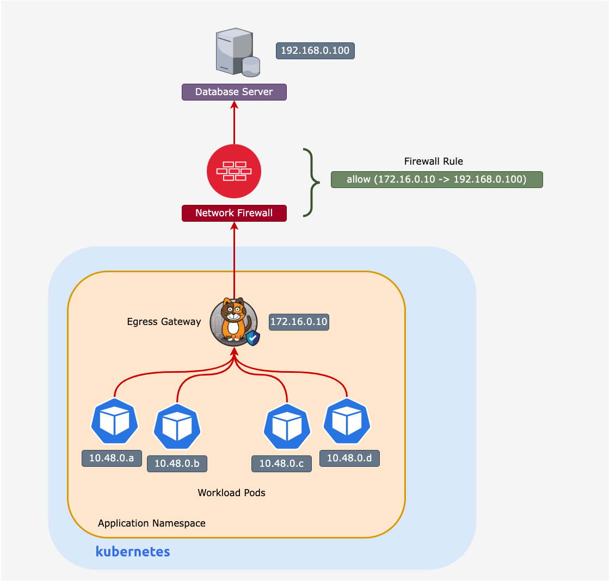

# Lesson -  Calico Egress Gateway

## Introduction

Calico egress gateways are pods that act as gateways for specified workload pods, as traffic from those pods leaves the cluster. The objective is to provide a predictable source IP when connecting to external services and extend the identity of a namespace or pod beyond the cluster. 

## Egress Gateway Features

- Route traffic for pods, deployments, or namespaces via a single or a collection of egress gateways. 

- Enforce Calico security policies as traffic leaves the workload pod. 

- Packets from the workload pods are sent to the egress gateways using VXLAN overlay. Similarly, return traffic from the egress gateway is routed to the workload pod via VXLAN. 

- Egress gateways are deployed as Kubernetes `deployments` or `daemonsets`

