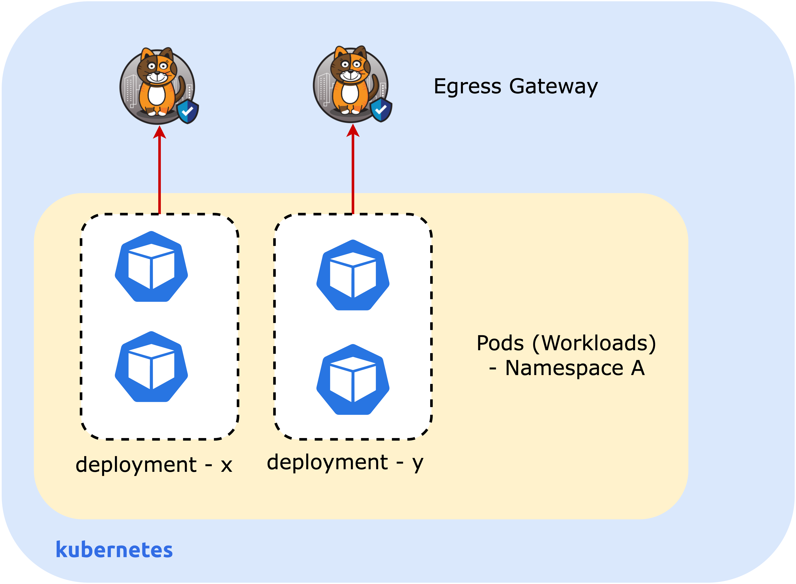

# Lesson -  Egress Gateway per Deployment

## Introduction

This lab will demonstrate egress gateway per deployment; it includes the following tasks

1. Enable egress gateway support for namespaces and deployments
2. Create IP pools for `app1` and `app2` deployments
2. Deploy egress gateways 



## Configure egress gateway

Remove the egress gateway annotation in the `apps` namespace applied in the previous lesson. 

```
kubectl annotate ns apps egress.projectcalico.org/selector-
```

### Enable egress gateway per namespace or per pod

```
kubectl patch felixconfiguration.p default --type='merge' -p \
    '{"spec":{"egressIPSupport":"EnabledPerNamespaceOrPerPod"}}'
```

### Create an `IPPool`

Create two IP pools. 

```
kubectl apply -f -<<EOF
apiVersion: projectcalico.org/v3
kind: IPPool
metadata:
  name: egress-ippool-app1
spec:
  cidr: 10.51.0.0/31
  blockSize: 31
  nodeSelector: "!all()"

---
apiVersion: projectcalico.org/v3
kind: IPPool
metadata:
  name: egress-ippool-app2
spec:
  cidr: 10.52.0.0/31
  blockSize: 31
  nodeSelector: "!all()"
EOF
```

### Deploy egress gateway for `app1` deployment

```
kubectl apply -f - <<EOF
apiVersion: operator.tigera.io/v1
kind: EgressGateway
metadata:
  name: egress-gateway-app1
  namespace: apps
spec:
  logSeverity: "Info"
  replicas: 1
  ipPools:
  - cidr: "10.51.0.0/31"
  template:
    metadata:
      labels:
        egress-code: app1
    spec:
      nodeSelector:
        kubernetes.io/os: linux
      terminationGracePeriodSeconds: 0
EOF
```

### Deploy egress gateway for `app2` deployment

```
kubectl apply -f - <<EOF
apiVersion: operator.tigera.io/v1
kind: EgressGateway
metadata:
  name: egress-gateway-app2
  namespace: apps
spec:
  logSeverity: "Info"
  replicas: 1
  ipPools:
  - cidr: "10.52.0.0/31"
  template:
    metadata:
      labels:
        egress-code: app2
    spec:
      nodeSelector:
        kubernetes.io/os: linux
      terminationGracePeriodSeconds: 0
EOF
```

### Apply annotation to the app1 deployment


```
kubectl patch deployment app1 -n apps -p '{"spec": {"template":{"metadata":{"annotations":{"egress.projectcalico.org/selector":"egress-code == \"app1\""}}}} }'
```

```
kubectl patch deployment app2 -n apps -p '{"spec": {"template":{"metadata":{"annotations":{"egress.projectcalico.org/selector":"egress-code == \"app2\""}}}} }'
```


## Configure BGP

### BGP configuration on Calico

Configure BGP to route traffic to the bastion host through the egress gateway.

```
kubectl apply -f -<<EOF
apiVersion: projectcalico.org/v3
kind: BGPPeer
metadata:
  name: bgppeer-global-64512
spec:
  peerIP: 10.0.1.10
  asNumber: 64512
---
apiVersion: projectcalico.org/v3
kind: BGPConfiguration
metadata:
  name: default
spec:
  serviceClusterIPs:
  - cidr: 10.49.0.0/16
  communities:
  - name: bgp-large-community
    value: 64512:120
  prefixAdvertisements:
  - cidr: 10.50.0.0/31
    communities:
    - bgp-large-community
    - 64512:120
  prefixAdvertisements:
  - cidr: 10.51.0.0/31
    communities:
    - bgp-large-community
    - 64512:120
  prefixAdvertisements:
  - cidr: 10.52.0.0/31
    communities:
    - bgp-large-community
    - 64512:120
EOF
```


## Summary

This lab demonstrated how to deploy Calico egress gateway and test its functionality by peering to an external BGP router. 


