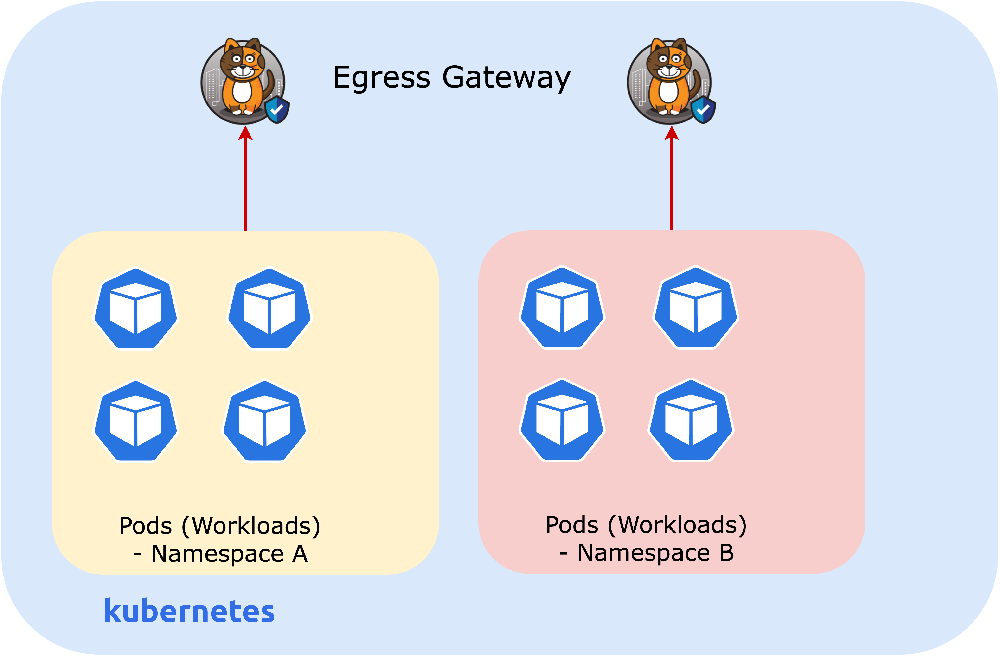

# Lesson -  Egress Gateway per Namespace

## Introduction

This lab will demonstrate egress gateway per namespace deployment. It includes the following tasks. 

1. Enable egress gateway per namespace
2. Deploy egress gateway in `apps` namespace
3. Configure BGP peering with the upstream router and advertise egress gateway IP pools. 
4.  Test and Verify the communication



## Deploy and configure egress gateway

### Enable egress gateway per namespace

Patch Felix configuration to support egress gateway per namespace

```
kubectl patch felixconfiguration.p default --type='merge' -p \
    '{"spec":{"egressIPSupport":"EnabledPerNamespace"}}'
```

### Enable policy sync API

```
kubectl patch felixconfiguration.p default --type='merge' -p \
    '{"spec":{"policySyncPathPrefix":"/var/run/nodeagent"}}'
```

### Create an `IPPool`

Create an IP Pool for Egress Gateway Pod

```
kubectl apply -f -<<EOF
apiVersion: projectcalico.org/v3
kind: IPPool
metadata:
  name: egress-ippool-1
spec:
  cidr: 10.50.0.0/31
  blockSize: 31
  nodeSelector: "!all()"
EOF
```

### Apply pull-secret

Create a pull secret into egress gateway namespace

```
kubectl get secret tigera-pull-secret --namespace=calico-system -o yaml | \
   grep -v '^[[:space:]]*namespace:[[:space:]]*calico-system' | \
   kubectl apply --namespace=apps -f -
```

### Deploy egress gateway

Deploy egress gateway in the `apps` namespace using the `egress-code: per-ns` label. The `IPPool` for the egress gateway deployment is specified using the `cni.projectcalico.org/ipv4pools: "[\"10.50.0.0/31\"]"` annotation. It is also possible to set the `IPPool` using its name (e.g. egress-ippool-1).


```
kubectl apply -f - <<EOF
apiVersion: apps/v1
kind: Deployment
metadata:
  name: egress-gateway
  namespace: apps 
  labels:
    egress-code: per-ns
spec:
  replicas: 1
  selector:
    matchLabels:
      egress-code: per-ns
  template:
    metadata:
      annotations:
        cni.projectcalico.org/ipv4pools: "[\"10.50.0.0/31\"]"
      labels:
        egress-code: per-ns
    spec:
      imagePullSecrets:
      - name: tigera-pull-secret
      nodeSelector:
        kubernetes.io/os: linux
      initContainers:
      - name: egress-gateway-init
        command: ["/init-gateway.sh"]
        image: quay.io/tigera/egress-gateway:v3.15.1
        env:
        # Use downward API to tell the pod its own IP address.
        - name: EGRESS_POD_IP
          valueFrom:
            fieldRef:
              fieldPath: status.podIP
        securityContext:
          privileged: true
      containers:
      - name: egress-gateway
        command: ["/start-gateway.sh"]
        image: quay.io/tigera/egress-gateway:v3.15.1
        env:
        # Optional: comma-delimited list of IP addresses to send ICMP pings to; if all probes fail, the egress
        # gateway will report non-ready.
        - name: ICMP_PROBE_IPS
          value: ""
        # Only used if ICMP_PROBE_IPS is non-empty: interval to send probes.
        - name: ICMP_PROBE_INTERVAL
          value: "5s"
        # Only used if ICMP_PROBE_IPS is non-empty: timeout before reporting non-ready if there are no successful 
        # ICMP probes.
        - name: ICMP_PROBE_TIMEOUT
          value: "15s"
        # Optional comma-delimited list of HTTP URLs to send periodic probes to; if all probes fail, the egress
        # gateway will report non-ready.
        - name: HTTP_PROBE_URLS
          value: ""
        # Only used if HTTP_PROBE_URL is non-empty: interval to send probes.
        - name: HTTP_PROBE_INTERVAL
          value: "10s"
        # Only used if HTTP_PROBE_URL is non-empty: timeout before reporting non-ready if there are no successful 
        # HTTP probes.
        - name: HTTP_PROBE_TIMEOUT
          value: "30s"
        # Port that the egress gateway serves its health reports.  Must match the readiness probe and health
        # port defined below.
        - name: HEALTH_PORT
          value: "8080"
        - name: EGRESS_POD_IP
          valueFrom:
            fieldRef:
              fieldPath: status.podIP
        securityContext:
          capabilities:
            add:
            - NET_ADMIN
        volumeMounts:
        - mountPath: /var/run
          name: policysync
        ports:
        - name: health
          containerPort: 8080
        readinessProbe:
          httpGet:
            path: /readiness
            port: 8080
          initialDelaySeconds: 3
          periodSeconds: 3
      terminationGracePeriodSeconds: 0
      volumes:
      - csi:
          driver: csi.tigera.io
        name: policysync
EOF
```

### Annotate the Namespace to use an Egress Gateway

```
kubectl annotate ns apps egress.projectcalico.org/selector='egress-code == "per-ns"'
```

### Verify the POD and Egress Gateway

```
tigera@bastion:~$ kubectl get pods -n apps -o wide 
NAME                              READY   STATUS    RESTARTS   AGE   IP            NODE                                         NOMINATED NODE   READINESS GATES
app1-786b5b9b7f-fgw6h             1/1     Running   0          14m   10.48.0.83    ip-10-0-1-30.ca-central-1.compute.internal   <none>           <none>
app1-786b5b9b7f-rdgdg             1/1     Running   0          14m   10.48.0.245   ip-10-0-1-31.ca-central-1.compute.internal   <none>           <none>
app2-77c4f547ff-5744g             1/1     Running   0          13m   10.48.0.247   ip-10-0-1-31.ca-central-1.compute.internal   <none>           <none>
app2-77c4f547ff-cts6r             1/1     Running   0          13m   10.48.0.85    ip-10-0-1-30.ca-central-1.compute.internal   <none>           <none>
egress-gateway-658b647cc4-ls6lm   1/1     Running   0          35s   10.50.0.0     ip-10-0-1-31.ca-central-1.compute.internal   <none>           <none>
```

## Configure BGP

### BGP configuration on Calico

Configure BGP to route traffic to the bastion host through the egress gateway.

```
kubectl apply -f -<<EOF
apiVersion: projectcalico.org/v3
kind: BGPPeer
metadata:
  name: bgppeer-global-64512
spec:
  peerIP: 10.0.1.10
  asNumber: 64512
---
apiVersion: projectcalico.org/v3
kind: BGPConfiguration
metadata:
  name: default
spec:
  serviceClusterIPs:
  - cidr: 10.49.0.0/16
  communities:
  - name: bgp-large-community
    value: 64512:120
  prefixAdvertisements:
  - cidr: 10.50.0.0/31
    communities:
    - bgp-large-community
    - 64512:120
EOF
```

### Verify BGP Peering

The bastion host is simulating a ToR switch, and it should have BGP peerings `establisehd` with all the nodes. 

```
sudo birdc show protocols
```

```
BIRD 1.6.8 ready.
name     proto    table    state  since       info
direct1  Direct   master   up     08:15:34    
kernel1  Kernel   master   up     08:15:34    
device1  Device   master   up     08:15:34    
control1 BGP      master   up     13:24:20    Established   
worker1  BGP      master   up     13:24:20    Established   
worker2  BGP      master   up     13:24:20    Established   
```

If you check the routes, you will see the edge gateway is reachable through the worker node where it has been deployed:

```
ip route
```
```
tigera@bastion:/var/run/bird$ ip route
default via 10.0.1.1 dev ens5 proto dhcp src 10.0.1.10 metric 100 
10.0.1.0/24 dev ens5 proto kernel scope link src 10.0.1.10 
10.0.1.1 dev ens5 proto dhcp scope link src 10.0.1.10 metric 100 
10.49.0.0/16 proto bird 
        nexthop via 10.0.1.20 dev ens5 weight 1 
        nexthop via 10.0.1.30 dev ens5 weight 1 
        nexthop via 10.0.1.31 dev ens5 weight 1 
10.50.0.0/31 via 10.0.1.31 dev ens5 proto bird 
10.50.0.1 via 10.0.1.30 dev ens5 proto bird 
```

## Verification

### Verify Egress Gateway

Open a second browser tab and navigate to your lab (`<LABNAME>.lynx.tigera.ca`) and start a `tcpdump` in the bastion host to listen to traffic on a specific port:

```
 sudo tcpdump -ni ens5 port 7777
```

On the original terminal window, exec into any of the pods in the apps namespace.

```
APP1_POD=$(kubectl get pod -n apps --no-headers -o name | grep -i app1 | head -1) && echo $APP1_POD
```
```
kubectl exec -ti $APP1_POD -n apps -- sh
```

And try to connect to the port in the bastion host.

```
nc -zv 10.0.1.10 7777
```

Type `exit` to exit out the pod terminal.

Go to the terminal where that you ran teh tcpdump utility on the bastion node. You should see an output saying you connected from the IP of one of the egress gateway, instead of the original pod address:

```
tigera@bastion:~$  sudo tcpdump -ni ens5 port 7777
tcpdump: verbose output suppressed, use -v or -vv for full protocol decode
listening on ens5, link-type EN10MB (Ethernet), capture size 262144 bytes
14:30:37.988383 IP 10.50.0.0.36851 > 10.0.1.10.7777: Flags [S], seq 587933189, win 62727, options [mss 8961,sackOK,TS val 3507190559 ecr 0,nop,wscale 7], length 0
14:30:37.988405 IP 10.0.1.10.7777 > 10.50.0.0.36851: Flags [R.], seq 0, ack 587933190, win 0, length 0
```

### Routing info on the Calico Node where App Workload is running

Login to worker node where the egress gateway and pods were deployed:

```
ssh worker2
```

Observe the routing policy is programmed for the the App workload POD IP

```
ip rule
```

```
0:      from all lookup local
100:    from 10.48.116.155 fwmark 0x80000/0x80000 lookup 250
32766:  from all lookup main
32767:  from all lookup default
```

Confirm that the policy is choosing the egress gateway as the next hop for any source traffic from App workload POD IP. 
#### Note: ensure to use the correct table number with the following command. In this case, the table number is 250.

```
ip route show table 250
```

```
default onlink 
        nexthop via 10.50.0.0 dev egress.calico weight 1 onlink 
        nexthop via 10.50.0.1 dev egress.calico weight 1 onlink
```

You can close the second browser tab with the terminal now as we will not use it for the rest of the labs.

## Summary

This lab demonstrated how to deploy Calico egress gateway and test its functionality by peering with an external BGP router. 
