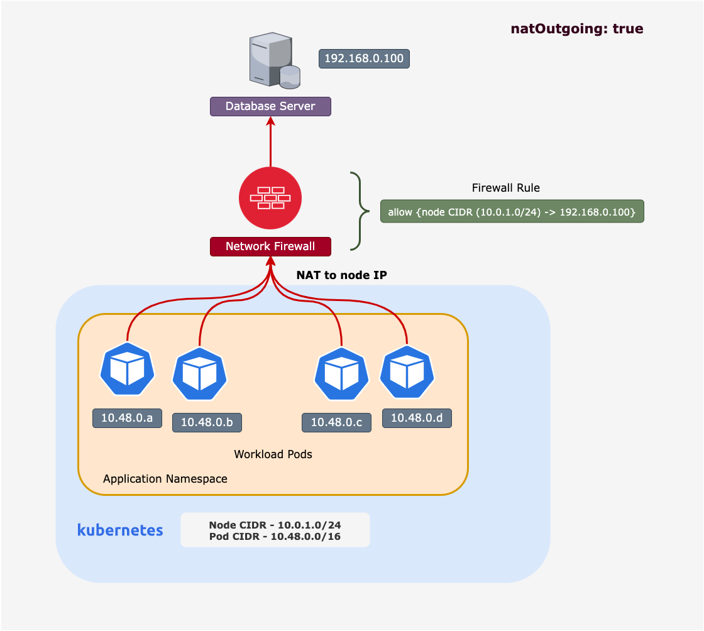
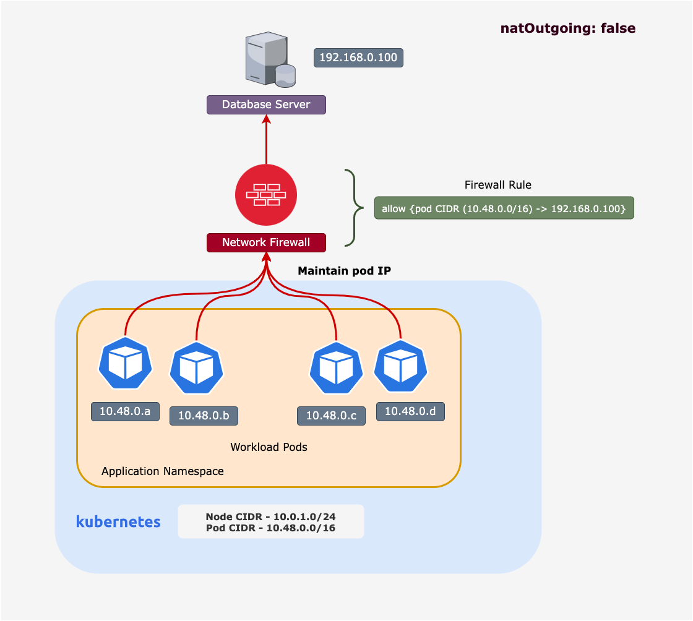

# Lesson -  Kubernetes Egress Introduction

## What is Kubernetes Egress

Connections from a pod to a service or host external to the cluster is considered Kubernetes egress. The CNI plugin handles egress communications. Egress access methods could be one of the following,

### `natOutgoing: true`

`natOutgoing: true` is the most common method for connecting to services outside the cluster when an overlay solution such as IPIP or VXLAN is in use. In this mode, when a pod connects to an external service, the source IP of the pod is NATed to the host IP. A host is the Kubernetes node on which the pod is deployed. `natOutgoing: true` is an `IPPOOL` configuration parameter in Calico. 

Consider an example in which pods in the cluster connect to an external database server. In such a scenario, the cluster node CIDR must be permitted in upstream network firewalls. 

### `natOutgoing: false`

`natOutgoing: false` can be used if the pod CIDRs are routable in the network. The communications will retain the IP address of the pod as it egresses the cluster. `natOutgoing: false` is an `IPPOOL` configuration parameter in Calico. 

Consider the same scenario in which pods in the cluster connect to an external database server. In such a scenario, the cluster pod CIDR must be permitted in upstream network firewalls. 

